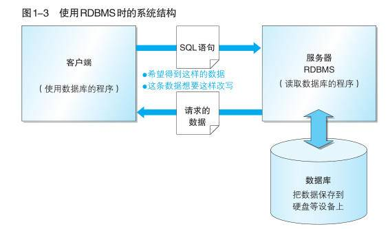
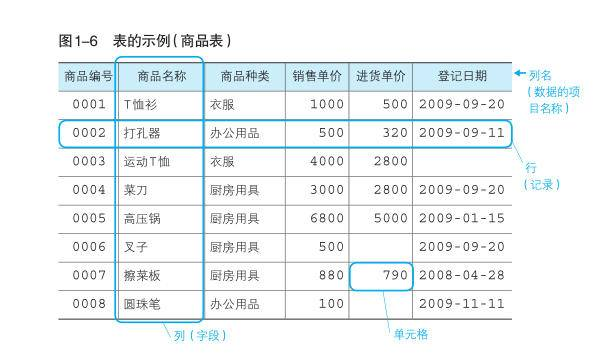
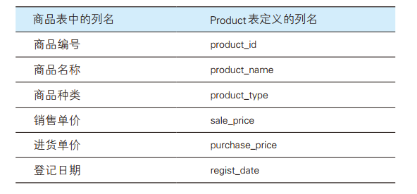
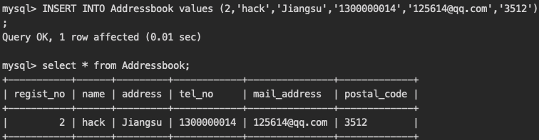

# SQL DAY 01

本次学习了数据库的定义，五个种类，其中关系型数据库，我们平常用的多，了解了SQL基本书写规则，SQL语句可分类为3类，其中DML的sql语法用的最多。此外，学习了数据库的创建，表的创建、更新、删除，向表中插入数据等操作。

之前搭建过关系型数据库mysql，但是忘记了密码。于是查了找回密码的方法，成功找回了。

> https://blog.csdn.net/yepiaouang/article/details/83022566
>
> 1. 停止MySQL服务：**sudo /usr/local/mysql/support-files/mysql.server stop**
>
> 2. 进入终端输入：**cd /usr/local/mysql/bin/**
> 3. 回车后 登录管理员权限： **sudo su**
> 4. 回车后输入以下命令来禁止mysql验证功能： **./mysqld_safe --skip-grant-tables &**
> 5. 输入命令 **./mysql**
> 6. 输入命令 **FLUSH PRIVILEGES**
> 7. 输入命令 **SET PASSWORD FOR 'root'@'localhost' = PASSWORD('你的新密码')**

## 1 初识数据集

* 数据库（database，DB）：将大量数据保存起来，通过计算机加工而成的可以进行高效访问的数据集合
* 数据库管理系统（Database Management System，DBMS）：用来管理数据库的计算机系统

#### DBMS的种类

主要通过数据的保存格式（数据库的种类）进行分类，可分为五种类型

* 层次数据库（Hierarchical Database，HDB）

* 关系数据库（Relational Database，RDB）

  * Oracle Database 甲骨文公司
  * SQL Server 微软
  * DB2 IBM
  * RostgreSQL 开源
  * MySQL 开源

  五种有代表性的RDBMS，特点由行和列组成的二维表来管理数据

* 面向对象数据库（Object Oriented Database，OODB）
* XML数据库（XML Database，XMLDB）
* 键值存储系统（Key-Value Store，KVS），如：MongoDB

#### RDBMS常见系统结构

使用 RDBMS 时，最常见的系统结构就是客户端 / 服务器类型（C/S类型）



## 2 初识SQL

数据库存储的表结构类似于excel中的行和列

* 行：称为记录，相当于一条记录
* 列：称为字段，代表了表格中存储的数据项目

* 单元格：行和列交汇的地方，一个单元格只能输入一条记录



根据对 RDBMS 赋予的指令种类的不同，SQL语句可以分类三类，实际使用中有90%属于DML：

* DML：（Data Manipulation Language，数据操纵语言） 用来查询或者变更表中的记录。
  * SELECT：查询表格中的数据
  * UPDATE：更新...
  * DELETE：删除...
  * INSERT：向表中插入新数据

* DDL：（Data Definition Language，数据定义语言） 用来创建或者删除存储数据用的数据库以及数据库中的表等对象。DDL 包含以下几种指令。
  * CREATE：创建数据库和表等对象
  * DROP：删除...
  * ALTER：修改...

* DCL:（Data Control Language，数据控制语言） 用来确认或者取消对数据库中的数据进行的变更。除此之外，还可以对 RDBMS 的用户是否有权限操作数据库中的对象（数据库表等）进行设定。
  * COMMIT:确认对数据库中的数据进行的变更
  * ROLLBACK：取消...
  * GRANT：赋予用户操作权限
  * REVOKE：取消...

### SQL基本书写规则

* 以分号（；）结尾

* 不区分关键字的大小写，但是插入到表中的数据是区分大小写的。

* SQL 不区分关键字的大小写，但是插入到表中的数据是区分大小写的
* win 系统默认不区分表名及字段名的大小写
* linux / mac 默认严格区分表名及字段名的大小写
      * 本教程已统一调整表名及字段名的为小写，以方便初学者学习使用。··

* 单词需要用半角空格或者换行来分隔

SQL 语句的单词之间需使用半角空格或换行符来进行分隔，且不能使用全角空格作为单词的分隔符，否则会发生错误，出现无法预期的结果。


#### 数据库的创建（CREATE DATABASE 语句）

语法：

```sql
CREATE DATABASE <数据库名称>;
```

创建数据库举例：

```sql
CREATE DATABASE shop;
```

#### 创建表 （ CREATE TABLE 语句）

语法：

```sql
CREATE TABLE < 表名 >
( < 列名 1> < 数据类型 > < 该列所需约束 > ,
  < 列名 2> < 数据类型 > < 该列所需约束 > ,
  < 列名 3> < 数据类型 > < 该列所需约束 > ,
  < 列名 4> < 数据类型 > < 该列所需约束 > ,
  .
  .
  .
  < 该表的约束 1> , < 该表的约束 2> ,……);
```

创建实例：

```sql
CREATE TABLE product
(product_id CHAR(4) NOT NULL,
 product_name VARCHAR(100) NOT NULL,
 product_type VARCHAR(32) NOT NULL,
 sale_price INTEGER ,
 purchase_price INTEGER ,
 regist_date DATE ,
 PRIMARY KEY (product_id));
```

#### 命名规则

* 只能使用半角英文字母、数字、下划线（_）作为数据库、表和列的名称
* 名称必须以半角英文字母开头



​																	商品表和 product 表列名的对应关系

#### 数据类型指定

数据库创建的表，所有的列都必须指定数据类型，每一列都不能存储与该列数据类型不符的数据。

四种最基本的数据类型

* INTEGER型：用来指定存储整数的列的数据类型（数字型），不能存储小数。

* CHAR型：用来存储定长字符串，当列中存储的字符串长度达不到最大长度的时候，使用半角空格进行补足，由于会浪费存储空间，所以一般不使用。

* VARCHAR型：用来存储可变长度字符串，定长字符串在字符数未达到最大长度时会用半角空格补足，但可变长字符串不同，即使字符数未达到最大长度，也不会用半角空格补足。

* DATE型：指定存储日期（年月日）的列的数据类型（日期）

  

#### 约束设置

约束是除了数据类型之外，对列中存储的数据进行限制或者追加条件的功能

`NOT NULL` 非空约束，即该列必须输入数据

`PRIMARY KEY`是主键约束，代表该列是唯一值，可以通过该列取出特定的行的数据

#### 表的删除和更新

* 删除表的语法：

```sql
DROP TABLE <表名>;
```

* 删除product表

需要特别注意的是，删除的表是无法恢复的，只能重新插入，请执行删除操作时要特别谨慎。

```sql
DROP TABLE product;
```

* 添加列的ALTER TABLE语句

```sql
ALTER TABLE < 表名 > ADD COLUMN < 列的定义 >;
```

* 实例：添加一列可以存储100位的可变长字符串的 product_table 列

```sql
ALTER TABLE product ADD COLUMN product_table VARCHAR(100);
```

* 删除列的ALTER TABLE语句

```sql
ALTER TABLE <表名> DROP COLUMN <列名>;
```

* 实例：删除product_table列

```sql
ALTER TABLE product DROP COLUMN product_table;
```

* 删除表中特定的行（语法）

```sql
-- 一定注意添加 WHERE 条件，否则将会删除所有的数据
DELETE FROM product WHERE COLUMN_NAME='XXX';
```

> ALTER TABLE 语句和 DROP TABLE 语句一样，执行之后无法恢复。误添加的列可以通过 ALTER TABLE 语句删除，或者将表全部删除之后重新再创建。

【扩展内容】

* 清空表内容

```sql
TRUNCATE TABLE TABLE_NAME;
```

优点：相比`drop / delete`, `truncate` 用来清除数据时，速度最快

* 数据的更新

基本语法：

```sql
UPDATE <表名>
   SET <列名> = <表达式> [, <列名2>=<表达式2>...];  
 WHERE <条件>;  -- 可选，非常重要。
 ORDER BY 子句;  --可选
 LIMIT 子句; --可选
```

> 使用 update 时要注意添加 where 条件，否则将会将所有的行按照语句修改

```sql
-- 修改所有的注册时间
UPDATE product
   SET regist_date = '2009-10-10';  
-- 仅修改部分商品的单价
UPDATE product
   SET sale_price = sale_price * 10
 WHERE product_type = '厨房用具';  
```

使用 UPDATE 也可以将列更新为 NULL（该更新俗称为NULL清空）。此时只需要将赋值表达式右边的值直接写为 NULL 即可。

```sql
-- 将商品编号为0008的数据（圆珠笔）的登记日期更新为NULL  
UPDATE product
   SET regist_date = NULL
 WHERE product_id = '0008';  
```

...

#### 向product表中插入数据

首先创建一个名为  productins 的表，建表语句如下：

```sql
CREATE TABLE productins
(product_id    CHAR(4)      NOT NULL,
product_name   VARCHAR(100) NOT NULL,
product_type   VARCHAR(32)  NOT NULL,
sale_price     INTEGER      DEFAULT 0,
purchase_price INTEGER ,
regist_date    DATE ,
PRIMARY KEY (product_id)); 
```

基本语法：

```sql
INSERT INTO <表名> (列1, 列2, 列3, ……) VALUES (值1, 值2, 值3, ……);  
```

对表进行全列 INSERT 时，可以省略表名后的列清单。这时 VALUES子句的值会默认按照从左到右的顺序赋给每一列.

```sql
-- 包含列清单
INSERT INTO productins (product_id, product_name, product_type, sale_price, purchase_price, regist_date) VALUES ('0005', '高压锅', '厨房用具', 6800, 5000, '2009-01-15');
-- 省略列清单
INSERT INTO productins VALUES ('0005', '高压锅', '厨房用具', 6800, 5000, '2009-01-15');  
```

> 原则上，执行一次 INSERT 语句会插入一行数据。插入多行时，通常需要循环执行相应次数的 INSERT 语句。其实很多 RDBMS 都支持一次插入多行数据

```sql
-- 通常的INSERT
INSERT INTO productins VALUES ('0002', '打孔器', '办公用品', 500, 320, '2009-09-11');
INSERT INTO productins VALUES ('0003', '运动T恤', '衣服', 4000, 2800, NULL);
INSERT INTO productins VALUES ('0004', '菜刀', '厨房用具', 3000, 2800, '2009-09-20');
-- 多行INSERT （ DB2、SQL、SQL Server、 PostgreSQL 和 MySQL多行插入）
INSERT INTO productins VALUES ('0002', '打孔器', '办公用品', 500, 320, '2009-09-11'),
                              ('0003', '运动T恤', '衣服', 4000, 2800, NULL),
                              ('0004', '菜刀', '厨房用具', 3000, 2800, '2009-09-20');  
-- Oracle中的多行INSERT
INSERT ALL INTO productins VALUES ('0002', '打孔器', '办公用品', 500, 320, '2009-09-11')
           INTO productins VALUES ('0003', '运动T恤', '衣服', 4000, 2800, NULL)
           INTO productins VALUES ('0004', '菜刀', '厨房用具', 3000, 2800, '2009-09-20')
SELECT * FROM DUAL;  
-- DUAL是Oracle特有（安装时的必选项）的一种临时表A。因此“SELECT *FROM DUAL” 部分也只是临时性的，并没有实际意义。  
```

> INSERT 语句中想给某一列赋予 NULL 值时，可以直接在 VALUES子句的值清单中写入 NULL。想要插入 NULL 的列一定不能设置 NOT NULL 约束。

```sql
INSERT INTO productins (product_id, product_name, product_type, sale_price, purchase_price, regist_date) VALUES ('0006', '叉子', '厨房用具', 500, NULL, '2009-09-20');  
```

可以使用INSERT … SELECT 语句从其他表复制数据。

```sql
-- 将商品表中的数据复制到商品复制表中
INSERT INTO productcopy (product_id, product_name, product_type, sale_price, purchase_price, regist_date)
SELECT product_id, product_name, product_type, sale_price, purchase_price, regist_date
  FROM Product;  
```

#### 索引

##### 索引的作用

MySQL索引的建立对于MySQL的高效运行是很重要的，索引可以大大提高MySQL的检索速度。

打个比方，如果合理的设计且使用索引的 MySQL 是一辆兰博基尼的话，那么没有设计和使用索引的 MySQL 就是一个人力三轮车。

拿汉语字典的目录页（索引）打比方，我们可以按拼音、笔画、偏旁部首等排序的目录（索引）快速查找到需要的字。

索引创建了一种有序的数据结构，采用二分法搜索数据时，其复杂度为 log2(N)，1000多万的数据只要搜索23次，其效率是非常高效的。

##### 索引分类

- 主键索引

建立在主键上的索引被称为主键索引，一张数据表只能有一个主键索引，索引列值不允许有空值，通常在创建表时一起创建。

- 唯一索引

建立在UNIQUE字段上的索引被称为唯一索引，一张表可以有多个唯一索引，索引列值允许为空，列值中出现多个空值不会发生重复冲突。

- 普通索引

建立在普通字段上的索引被称为普通索引。

- 前缀索引

前缀索引是指对字符类型字段的前几个字符或对二进制类型字段的前几个bytes建立的索引，而不是在整个字段上建索引。前缀索引可以建立在类型为char、varchar、binary、varbinary的列上，可以大大减少索引占用的存储空间，也能提升索引的查询效率。

- 全文索引

利用“分词技术”实现在长文本中搜索关键字的一种索引。

语法：`SELECT * FROM article WHERE MATCH (col1，col2，...) AGAINST (expr [ search _ modifier ])`

### 练习题

#### 1.1

编写一条 CREATE TABLE 语句，用来创建一个包含表 1-A 中所列各项的表 Addressbook （地址簿），并为 regist_no （注册编号）列设置主键约束

表1-A　表 Addressbook （地址簿）中的列


```sql
CREATE TABLE Addressbook(
  regist_no INTEGER NOT NULL,
  name VARCHAR(128) NOT NULL,
  address VARCHAR(256) NOT NULL,
  tel_no CHAR(10),
  mail_address CHAR(20),
  PRIMARY KEY (regist_no)
);
```

#### 1.2

假设在创建练习1.1中的 Addressbook 表时忘记添加如下一列 postal_code （邮政编码）了，请编写 SQL 把此列添加到 Addressbook 表中。

列名        ： postal_code

数据类型 ：定长字符串类型（长度为 8）

约束        ：不能为 NULL

```sql
ALTER TABLE Addressbook ADD COLUMN postal_code CHAR(8) NOT NULL; 
```



#### 1.3

请补充如下 SQL 语句来删除 Addressbook 表。

```sql
( DROP ) table Addressbook;
```

#### 1.4

是否可以编写 SQL 语句来恢复删除掉的 Addressbook 表？

可以

https://blog.csdn.net/weixin_41004350/article/details/78547005
