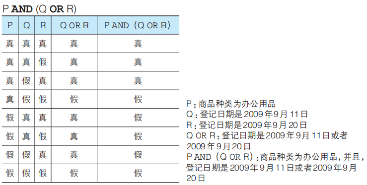

## 02_query_sort

> notes written by h1astro. 2021.9.15

### SELECT 语句基础

#### 从表中选取数据

使用SELECT语句从表中选取数据

匹配查询或查询(query)：通过select语句查询并选取必要数据的过程

语法

```sql
SELECT <列名>,
	FROM <表名>;
```

### 从表中选取符合条件的数据

#### WHERE 语句

不想展示全部数据，需求是想找符合满足特定条件的数据时，用where语句可以满足。

```sql
SELECT <列名>, ...
	FROM <表名>
WHERE <条件表达式>;
```

比较两者输出结果

```sql
-- 用来选取product type列为衣服的记录的SELECT语句
SELECT product_name, product_type
  FROM product
 WHERE product_type = '衣服';
-- 也可以选取出不是查询条件的列（条件列与输出列不同）
SELECT product_name
  FROM product
 WHERE product_type = '衣服';
```


#### 相关法则

* 星号（*）代表全部列
* SQL中可随意使用换行符，不影响语句执行（但不可插入空行）
* 汉语别名时需要使用双引号（""）
* SELECT语句用DISTINCT可以删除重复行
* 两种注释方式
  * 1行： "--"
  * 多行："/* */"

```sql
-- 想要查询出全部列时，可以使用代表所有列的星号（*）。
SELECT *
  FROM <表名>；
-- SQL语句可以使用AS关键字为列设定别名（用中文时需要双引号（“”））。
SELECT product_id     As id,
       product_name   As name,
       purchase_price AS "进货单价"
  FROM product;
-- 使用DISTINCT删除product_type列中重复的数据
SELECT DISTINCT product_type
  FROM product;
```

#### 算数运算符

|含义|运算符|
|-|-|
|加法|+|
|减法|-|
|乘法|*|
|除法|/|

#### 比较运算符

```sql
-- 选取出sale_price列为500的记录
SELECT product_name, product_type
  FROM product
 WHERE sale_price = 500;
```

比较运算符：

| 运算符 | 含义      |
| ------ | --------- |
| =      | 和~相等   |
| <>     | 和~不相等 |
| >=     | 大于等于~ |

#### 常用法则

* 子句中可以使用常数或者表达式
* 使用比较运算符时 要注意不等号和等号的位置
* 字符串类型的数据原则上按照字典顺序进行排序，不能与数字的大小顺序混淆。
* 选取NULL记录时，需要在条件表达式中使用IS NULL运算符。反之，用IS NOT NULL运算符

```sql
-- SQL语句中也可以使用运算表达式
SELECT product_name, sale_price, sale_price * 2 AS "sale_price x2"
  FROM product;
-- WHERE子句的条件表达式中也可以使用计算表达式
SELECT product_name, sale_price, purchase_price
  FROM product
 WHERE sale_price-purchase_price >= 500;
/* 对字符串使用不等号
首先创建chars并插入数据
选取出大于‘2’的SELECT语句*/
-- DDL：创建表
CREATE TABLE chars
（chr CHAR（3）NOT NULL, 
PRIMARY KEY（chr））;
-- 选取出大于'2'的数据的SELECT语句('2'为字符串)
SELECT chr
  FROM chars
 WHERE chr > '2';
-- 选取NULL的记录
SELECT product_name, purchase_price
  FROM product
 WHERE purchase_price IS NULL;
-- 选取不为NULL的记录
SELECT product_name, purchase_price
  FROM product
 WHERE purchase_price IS NOT NULL;
```

#### 逻辑运算符

##### NOT运算符

想要表示“不是……”时，除了前文的`<>`运算符外，还存在另外一个表示否定、使用范围更广的运算符：`NOT`。

```sql
SELECT product_name, product_type, sale_price
  FROM product
 WHERE NOT sale_price >= 1000;
```

##### AND 与 OR 运算符

AND 相当于“并且”，类似数学中的取交集；

OR 相当于“或者”，类似数学中的取并集。

#### 括号优先处理

如果要查找这样一个商品，该怎么处理？

>“商品种类为办公用品”并且“登记日期是 2009 年 9 月 11 日或者 2009 年 9 月 20 日”
>理想结果为“打孔器”，但当你输入以下信息时，会得到错误结果

```sql
-- 将查询条件原封不动地写入条件表达式，会得到错误结果
SELECT product_name, product_type, regist_date
  FROM product
 WHERE product_type = '办公用品'
   AND regist_date = '2009-09-11'
    OR regist_date = '2009-09-20';
```
错误原因时**AND运算符优先于OR运算符**，想要优先执行OR运算，可以使用**括号**：

```sql
-- 通过使用括号让OR运算符先于AND运算符执行
SELECT product_name, product_type, regist_date
  FROM product
 WHERE product_type = '办公用品'
   AND ( regist_date = '2009-09-11'
        OR regist_date = '2009-09-20');
```

#### 真值表

查询条件为P AND（Q OR R）的真值表



#### 含有NULL时的真值

NULL的真值结果不为真，也不为假，因为并不知道这样一个值。

那该如何表示呢？

这时真值是除真假之外的第三种值——**不确定**（UNKNOWN）。一般的逻辑运算并不存在这第三种值。SQL 之外的语言也基本上只使用真和假这两种真值。与通常的逻辑运算被称为二值逻辑相对，只有 SQL 中的逻辑运算被称为三值逻辑。

三值逻辑下的AND和OR真值表为：


## 练习题-第一部分

### 2.1

编写一条SQL语句，从 `product`(商品) 表中选取出“登记日期(`regist`)在2009年4月28日之后”的商品，查询结果要包含 `product name` 和 `regist_date` 两列。

```sql
SELECT product_name, regist_date  FROM product WHERE regist>'2009-04-28'
```


### 2.2

请说出对product 表执行如下3条SELECT语句时的返回结果。

①

```sql
SELECT *
  FROM product
 WHERE purchase_price = NULL;
```

②

```sql
SELECT *
  FROM product
 WHERE purchase_price <> NULL;
```

③

```sql
SELECT *
  FROM product
 WHERE product_name > NULL;
```

`NULL`的真值结果不为真，也不为假，因为并不知道这样一个值。所以这三条SELECT语句都不会返回数据

### 2.3

代码清单2-22（2-2节）中的SELECT语句能够从product表中取出“销售单价（saleprice）比进货单价（purchase price）高出500日元以上”的商品。请写出两条可以得到相同结果的SELECT语句。执行结果如下所示。

```sql
product_name | sale_price | purchase_price 
-------------+------------+------------
T恤衫         | 　 1000    | 500
运动T恤       |    4000    | 2800
高压锅        |    6800    | 5000
```

```sql
-- 第一种
SELECT product_name,sale_price,purchase_price
	FROM product
 WHERE sale_price - purchase_price > 500;

-- 第二种
SELECT product_name,sale_price,purchase_price
	FROM product
 WHERE purchase_price + 500 < sale_price;
 
```

 

### 2.4

请写出一条SELECT语句，从product表中选取出满足“销售单价打九折之后利润高于100日元的办公用品和厨房用具”条件的记录。查询结果要包括product_name列、product_type列以及销售单价打九折之后的利润（别名设定为profit）。

提示：销售单价打九折，可以通过saleprice列的值乘以0.9获得，利润可以通过该值减去purchase_price列的值获得。

```sql
SELECT product_name, product_type, sale_price * 0.9 - purchase_price as profit
	FROM product
 WHERE sale_price * 0.9 - purchase_price > 100;
```


### 对表进行聚合查询

##### 聚合函数

SQL中用于汇总的函数叫做聚合函数。以下五个是最常用的聚合函数：

* COUNT：计算表中的记录数
* SUM：计算表中数值列中数据的合计值
* AVG：....平均值
* MAX：求出表中任意列中数据的最大值
* MIN： ...最小值

```sql
-- 计算全部数据的行数（包含NULL）
SELECT COUNT(*)
  FROM product;
-- 计算NULL以外数据的行数
SELECT COUNT(purchase_price)
  FROM product;
-- 计算销售单价和进货单价的合计值
SELECT SUM(sale_price), SUM(purchase_price) 
  FROM product;
-- 计算销售单价和进货单价的平均值
SELECT AVG(sale_price), AVG(purchase_price)
  FROM product;
-- MAX和MIN也可用于非数值型数据
SELECT MAX(regist_date), MIN(regist_date)
  FROM product;
```

##### 聚合函数删除重复值

```sql
-- 计算去除重复数据后的数据行数
SELECT COUNT(DISTINCT product_type)
 FROM product;
-- 是否使用DISTINCT时的动作差异（SUM函数）
SELECT SUM(sale_price), SUM(DISTINCT sale_price)
 FROM product;
```

#### 常用法则

* COUNT函数的结果根据参数的不同而不同。COUNT(*)会得到包含NULL的数据行数，而COUNT(<列名>)会得到NULL之外的数据行数。
* 聚合函数会将NULL排除在外。但COUNT(*)例外，并不会排除NULL。
* MAX/MIN函数几乎适用于所有数据类型的列。SUM/AVG函数只适用于数值类型的列。
* 想要计算值的种类时，可以在COUNT函数的参数中使用DISTINCT。
* 在聚合函数的参数中使用DISTINCT，可以删除重复数据

#### 对表进行分组

##### GROUP BY语句

之前使用聚合函数都是会整个表的数据进行处理，当你想将进行分组汇总时（即：将现有的数据按照某列来汇总统计），GROUP BY可以帮助你：

```sql
SELECT <列名1>,<列名2>, <列名3>, ……
  FROM <表名>
 GROUP BY <列名1>, <列名2>, <列名3>, ……;
```

看一看是否使用GROUP BY语句的差异：

```sql
-- 按照商品种类统计数据行数
SELECT product_type, COUNT(*)
  FROM product
 GROUP BY product_type;
 -- 不含GROUP BY
SELECT product_type, COUNT(*)
  FROM product
```


按照商品种类对表进行切分

GROUP BY 子句就像切蛋糕那样将表进行了分组。

**聚合键**或者**分组列**：在 GROUP BY 子句中指定的列称。

##### 聚合键中包含NULL时

将进货单价(purchase_price)作为聚合键举例：

```sql
SELECT purchase_price, COUNT(*)
  FROM product
 GROUP BY purchase_price;
```


此时会将NULL作为一组特殊数据进行处理

##### GROUP BY书写位置

子句书写顺序要求严格，不按要求会导致SQL无法正常执行，目前出现过的字句顺序为：

SELECT -> FROM -> WHERE -> GROUP BY

其中前三项用于筛选数据，GROUP BY 对筛选出的数据进行处理

##### 在WHERE子句中使用GROUP BY

```sql
SELECT purchase_price, COUNT(*)
  FROM product
 WHERE product_type = '衣服'
 GROUP BY purchase_price;
```

##### 常见错误

1. 在聚合函数的SELECT子句中写了聚合键以外的列 使用COUNT等聚合函数时，SELECT子句中如果出现列名，只能是GROUP BY子句中**指定的列名**（也就是聚合键）。
2. 在GROUP BY子句中使用列的别名 SELECT子句中可以通过AS来指定别名，但在GROUP BY中不能使用别名。因为在DBMS中 ,SELECT子句在GROUP BY子句后执行。
3. 在WHERE中使用聚合函数 原因是聚合函数的使用前提是结果集已经确定，而WHERE还处于确定结果集的过程中，所以相互矛盾会引发错误。 如果想指定条件，可以在SELECT，HAVING 以及ORDER BY子句中使用聚合函数。

#### 为聚合结果指定条件

##### 用HAVING得到特定分组

将表使用GROUP BY分组后，怎样才能只取出其中两组？


这里WHERE不可行，因为，WHERE子句只能指定记录（行）的条件，而不能用来指定组的条件（例如，“数据行数为 2 行”或者“平均值为 500”等）。

可以在GROUP BY后**使用HAVING子句**。

#### HAVING 特点

HAVING子句用于对分组进行过滤，可以使用数字、聚合函数和GROUP BY中指定的列名（聚合键）。

```sql
-- 数字
SELECT product_type, COUNT(*)
  FROM product
 GROUP BY product_type
HAVING COUNT(*) = 2;
-- 错误形式（因为product_name不包含在GROUP BY聚合键中）
SELECT product_type, COUNT(*)
  FROM product
 GROUP BY product_type
HAVING product_name = '圆珠笔';
```

### 对查询结果进行排序

#### ORDER BY

SQL中的执行结果是随机排列的，当需要按照特定顺序排序时，可已使用**ORDER BY**子句。

```sql
SELECT <列名1>, <列名2>, <列名3>, ……
  FROM <表名>
 ORDER BY <排序基准列1>, <排序基准列2>, ……
```

默认为升序排列，降序排列为DESC

```sql
-- 降序排列
SELECT product_id, product_name, sale_price, purchase_price
  FROM product
 ORDER BY sale_price DESC;
-- 多个排序键
SELECT product_id, product_name, sale_price, purchase_price
  FROM product
 ORDER BY sale_price, product_id;
-- 当用于排序的列名中含有NULL时，NULL会在开头或末尾进行汇总。
SELECT product_id, product_name, sale_price, purchase_price
  FROM product
 ORDER BY purchase_price;
```

#### ORDER BY中列名可使用别名

GROUP BY 子句中不能使用SELECT 子句中定义的别名，但是在 ORDER BY 子句中却可以使用别名。为什么在GROUP BY中不可以而在ORDER BY中可以呢？

这是因为SQL在使用 HAVING 子句时 SELECT 语句的顺序为：

FROM → WHERE → GROUP BY → HAVING → SELECT → ORDER BY

其中SELECT的执行顺序在 GROUP BY 子句之后，ORDER BY 子句之前。也就是说，当在ORDER BY中使用别名时，已经知道了SELECT设置的别名存在，但是在GROUP BY中使用别名时还不知道别名的存在，所以不能在ORDER BY中可以使用别名，但是在GROUP BY中不能使用别名

##### ORDER BY 排序列中存在 NULL 时，指定其出现在首行或者末行的方式

在MySQL中，`NULL` 值被认为比任何 `非NULL` 值低，因此，当顺序为 ASC（升序）时，`NULL` 值出现在第一位，而当顺序为 DESC（降序）时，则排序在最后。

如果想指定存在 `NULL` 的行出现在首行或者末行，需要特殊处理。

```sql
CREATE TABLE user (
    id INT NOT NULL AUTO_INCREMENT,
    name VARCHAR(5),
    date_login DATE,
    PRIMARY KEY (id)
);

INSERT INTO user(name, date_login) VALUES
(NULL,    '2017-03-12'), 
('john',   NULL), 
('david', '2016-12-24'), 
('zayne', '2017-03-02');
```

既然排序时，`NULL` 的值比 `非NULL` 值低（可以理解为 `0` 或者 `-∞`），那么我们在排序时就要对这个默认情况进行特殊处理以达到想要的效果。

一般有如下两种需求：

- 将 `NULL` 值排在末行，同时将所有 `非NULL` 值按升序排列。

对于数字或者日期类型，可以在排序字段前添加一个负号（minus）来得到反向排序。（`-1、-2、-3....-∞`）


对于字符型或者字符型数字，此方法不一定能得到期望的排序结果，可以使用 `IS NULL` 比较运算符。另外 `ISNULL( )` 函数等同于使用 `IS NULL` 比较运算符。

   

还可以使用 `COALESCE` 函数实现需求


## 练习题-第二部分

### 2.5

请指出下述SELECT语句中所有的语法错误。

```sql
SELECT product_id, SUM（product_name）
--本SELECT语句中存在错误。
  FROM product 
 GROUP BY product_type 
 WHERE regist_date > '2009-09-01';
```

> 1. Product_name为字符类型，不为数值，不能用SUM函数
> 2. WHERE子句应在GROUP BY之前

### 2.6

请编写一条SELECT语句，求出销售单价（ `sale_price` 列）合计值大于进货单价（ `purchase_price` 列）合计值1.5倍的商品种类。执行结果如下所示。

```sql
product_type | sum  | sum 
-------------+------+------
衣服         | 5000 | 3300
办公用品      |  600 | 320
```


```sql
	SELECT product_type, SUM(sale_price), SUM(purchase_price)
		FROM product
GROUP BY product_type
	HAVING SUM(sale_price) > SUM(purchase_price) * 1.5;
```

> wrong version below
> ```sql
> SELECT product_type, SUM(sale_price), SUM(purchase_price)
> 	FROM product
>  WHERE SUM(sale_price) > SUM(purchase_price) * 1.5;
> ```

### 2.7

此前我们曾经使用SELECT语句选取出了product（商品）表中的全部记录。当时我们使用了 `ORDER BY` 子句来指定排列顺序，但现在已经无法记起当时如何指定的了。请根据下列执行结果，思考 `ORDER BY` 子句的内容。


```sql
SELECT *
	FROM product
ORDER BY -regist_date;
```

