## 03_complex_query

> Notes written by h1astro

### 视图

```sql
SELECT stu_name FROM view_students_info;
```

从SQL的角度来说`操作视图`与`操作表`看起来是完全相同的，那么为什么还会有视图的存在呢？视图到底是什么？视图与表有什么不同呢？

`视图`是一个虚拟的表，不同于直接操作数据表，视图是依据SELECT语句来创建的，所以操作视图时会根据创建视图的SELECT语句生成一张虚拟表，然后在这张虚拟表上做SQL操作。

#### 视图与表有什么区别

区别：“是否保存了实际的数据”。

视图并不是数据库真实存储的数据表，它可以看作是一个窗口，通过这个窗口看到数据库表中真实存在的数据。所以我们要区别视图和数据表的本质，**即**视图是基于真实表的一张虚拟的表，其数据来源均建立在真实表的基础上。

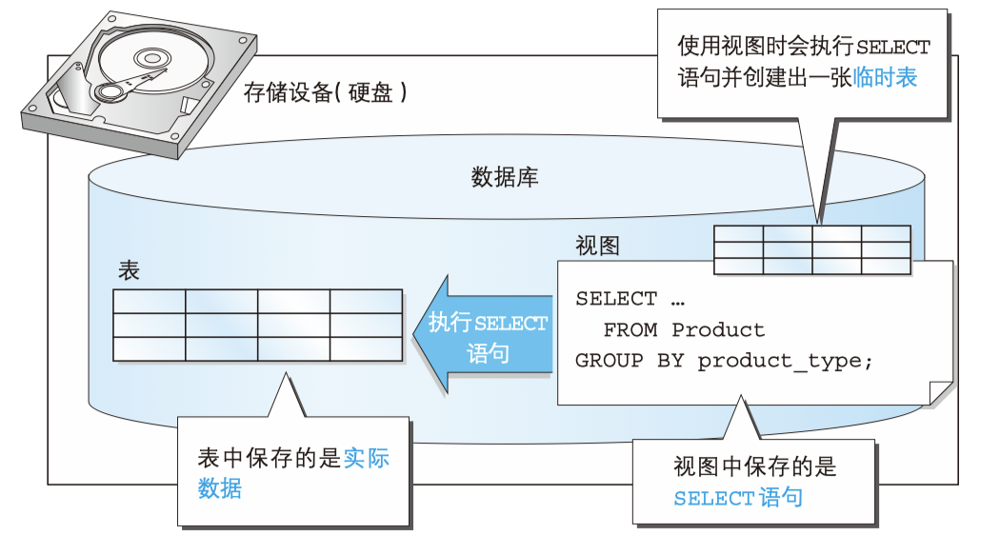

> 顺口溜 方便记忆视图与表的关系：“视图不是表，视图是虚表，视图依赖于表”。

#### 为什么会存在视图

1. 通过定义视图可以将频繁使用的SELECT语句保存以提高效率。
2. ...使用户看到的数据更加清晰。
3. ...不对外公开数据表全部字段，增强数据的保密性。
4. ...降低数据的冗余。

####  如何创建视图

```sql
CREATE VIEW <视图名称>(<列名1>,<列名2>,...) AS <SELECT语句>
```

其中SELECT 语句需要书写在 AS 关键字之后。 SELECT 语句中列的排列顺序和视图中列的排列顺序相同， 

SELECT 语句中的第 1 列就是视图中的第 1 列， SELECT 语句中的第 2 列就是视图中的第 2 列，以此类推。而且视图的列名是在视图名称之后的列表中定义的。
需要注意的是视图名在数据库中需要是唯一的，不能与其他视图和表重名。

视图不仅可以基于真实表，我们也可以在视图的基础上继续创建视图（但不建议，对多数DBMS而言，会降低SQL的性能）

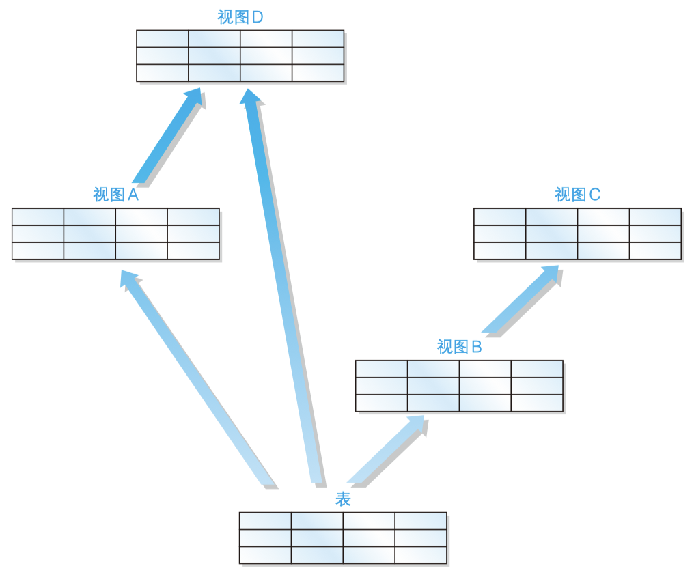

* 注意事项

需要注意的是在一般的DBMS中定义视图时不能使用ORDER BY语句。下面这样定义视图是**错误**的。

```sql
CREATE VIEW productsum (product_type, cnt_product)
AS
SELECT product_type, COUNT(*)
  FROM product
 GROUP BY product_type
 ORDER BY product_type;
```

为什么不能使用 ORDER BY 子句呢？这是因为视图和表一样，**数据行都是没有顺序的**。

* 基于单表的视图

在product表的基础上创建一个视图，如下：

```sql
CREATE VIEW productsum (product_type, cnt_product)
AS
SELECT product_type, COUNT(*)
  FROM product
 GROUP BY product_type ;
```

创建的视图如下图所示：

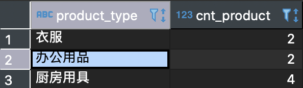

* 基于多表的视图

```sql
CREATE VIEW view_shop_product(product_type, sale_price, shop_name)
AS
SELECT product_type, sale_price, shop_name
  FROM product,
       shop_product
 WHERE product.product_id = shop_product.product_id;
```

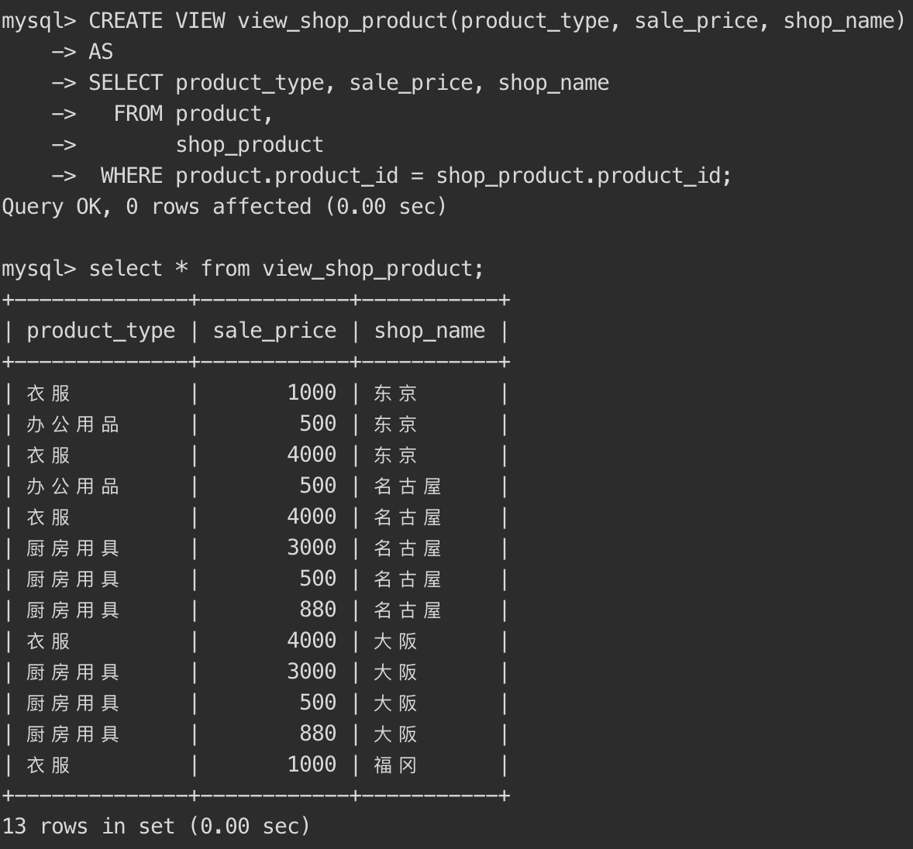

对视图查询

```sql
SELECT sale_price, shop_name
  FROM view_shop_product
 WHERE product_type = '衣服';
```

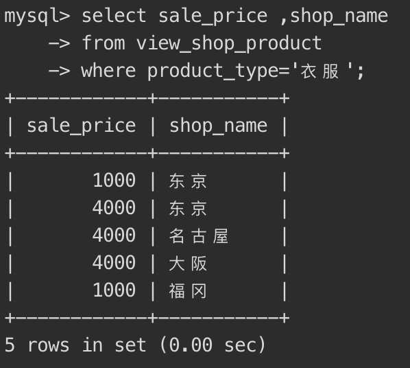

#### 修改视图结构

```sql
ALTER VIEW <视图名> AS <SELECT语句>
```

其中视图名在数据库中需要是唯一的，不能与其他视图和表重名。
也可以通过将当前视图删除然后重新创建的方式达到修改的效果。

* 视图

修改上方的view_shop_product视图为

```sql
ALTER VIEW view_shop_product
AS
SELECT product_type, sale_price
  FROM Product
 WHERE regist_date > '2009-09-11';
```

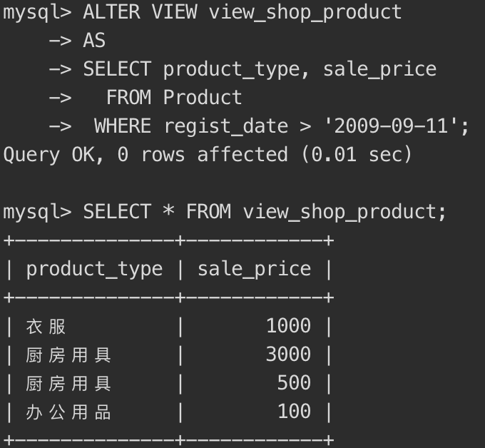

#### 更新视图内容

因为视图是一个虚拟表，所以对视图的操作就是对底层基础表的操作，所以在修改时只有满足底层基本表的定义才能成功修改。

对于一个视图来说，如果包含以下结构的任意一种都是不可以被更新的：

* 聚合函数 SUM()、MIN()、MAX()、COUNT() 等。
* DISTINCT 关键字。
* GROUP BY 子句。
* HAVING 子句。
* UNION 或 UNION ALL 运算符。
* FROM 子句中包含多个表。

视图归根结底还是从表派生出来的，因此，如果原表可以更新，那么 视图中的数据也可以更新。反之亦然，如果视图发生了改变，而原表没有进行相应更新的话，就无法保证数据的一致性了。

* 更新视图

```sql
UPDATE view_shop_product
   SET sale_price = '5000'
 WHERE product_type = '办公用品';
```

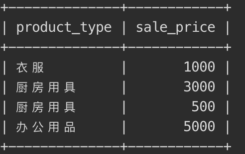

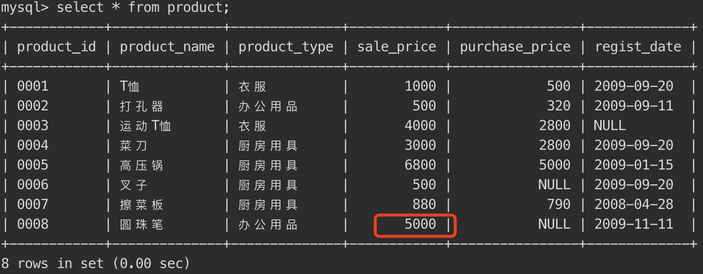

刚才修改视图的时候是设置product_type='办公用品'的商品的sale_price=5000，为什么原表的数据**只有一条**做了修改呢？(别的办公用品的值没有改变)

还是因为视图的定义，视图只是原表的一个窗口，所以它**修改也只能修改透过窗口能看到的内容**。

**注意：这里虽然修改成功了，但是并不推荐这种使用方式。而且我们在创建视图时也尽量使用限制不允许通过视图来修改表**

#### 删除视图

```sql
DROP VIEW <视图名1> [ , <视图名2> …]
```

> 注意：需要有相应的权限才能成功删除。

我们删除刚才创建的view_shop_product视图

```sql
DROP VIEW productSum;
```

### 子查询

```sql
SELECT stu_name
FROM (
         SELECT stu_name, COUNT(*) AS stu_cnt
          FROM students_info
          GROUP BY stu_age) AS studentSum;
```

看起来很好理解，其中使用括号括起来的sql语句首先执行，执行成功后再执行外面的sql语句。但是我们上一节提到的视图也是根据SELECT语句创建视图然后在这个基础上再进行查询。那么什么是子查询呢？子查询和视图又有什么关系呢？


`子查询`: 指一个查询语句嵌套在另一个查询语句内部的查询，这个特性从 MySQL 4.1 开始引入，在 SELECT 子句中先计算子查询，子查询结果作为外层另一个查询的过滤条件，查询可以基于一个表或者多个表。

####  子查询和视图的关系

> 一次性使用，不会像视图保存在存储介质中，在SELECT语句执行之后就消失了。

#### 嵌套子查询(不建议)

```sql
SELECT product_type, cnt_product
FROM (SELECT *
        FROM (SELECT product_type, 
                      COUNT(*) AS cnt_product
                FROM product 
               GROUP BY product_type) AS productsum
       WHERE cnt_product = 4) AS productsum2;
```

其中最内层的子查询将其命名为productSum，这条语句根据product_type分组并查询个数，第二层查询中将个数为4的商品查询出来，最外层查询product_type和cnt_product两列。
**虽然嵌套子查询可以查询出结果，但是随着子查询嵌套的层数的叠加，SQL语句不仅会难以理解而且执行效率也会很差，所以要尽量避免这样的使用。**

#### 标量子查询

标量就是单一的意思，那么标量子查询也就是单一的子查询，那什么叫做单一的子查询呢？

所谓单一就是要求我们执行的SQL语句只能返回一个值，也就是要返回表中具体的**某一行的某一列**。例如我们有下面这样一张表。返回“0004”，“菜刀”这样的结果。

```sql
product_id | product_name | sale_price 
------------+-------------+----------
0003       | 运动T恤       | 4000 
0004       | 菜刀          | 3000 
0005       | 高压锅        | 6800
```

##### 标量子查询用处

直接这样想可能会有些困难，看几个具体的需求：

1. 查询出销售单价高于平均销售单价的商品
2. 查询出注册日期最晚的那个商品

对于需求1的查询：

```sql
SELECT product_id, product_name, sale_price
  FROM product
 WHERE sale_price > (SELECT AVG(sale_price) FROM product);
```

由于标量子查询的特性，导致标量子查询不仅仅局限于 WHERE 子句中，通常任何可以使用单一值的位置都可以使用。也就是说， 能够使用常数或者列名的地方，无论是 SELECT 子句、GROUP BY 子句、HAVING 子句，还是 ORDER BY 子句，几乎所有的地方都可以使用。如：

```sql
SELECT product_id,
       product_name,
       sale_price,
       (SELECT AVG(sale_price)
          FROM product) AS avg_price
  FROM product;
```

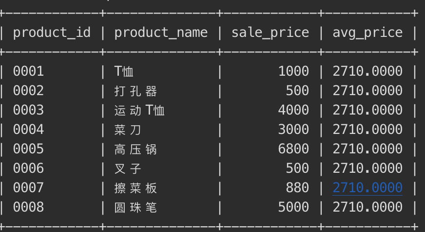

#### 关联子查询

关联子查询通过一些标志将内外两层的查询连接起来起到过滤数据的目的，


* 关联子查询与子查询的联系

1. `查询出销售单价高于平均销售单价的商品`

```sql
SELECT product_id, product_name, sale_price
  FROM product
 WHERE sale_price > (SELECT AVG(sale_price) FROM product);
```


2. `选取出各商品种类中高于该商品种类的平均销售单价的商品`

```sql
SELECT product_type, product_name, sale_price
  FROM product AS p1
 WHERE sale_price > (SELECT AVG(sale_price)
                       FROM product AS p2
                      WHERE p1.product_type = p2.product_type
   GROUP BY product_type);
```

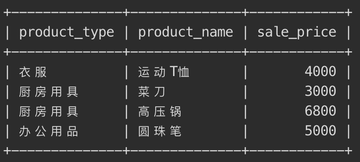

在第二条SQL语句也就是关联子查询中我们将外面的product表标记为p1，将内部的product设置为p2，而且通过WHERE语句连接了两个查询。

但是如果刚接触的话一定会比较疑惑关联查询的执行过程，这里有一个[博客](https://zhuanlan.zhihu.com/p/41844742)讲的比较清楚。在这里我们简要的概括为：

1. 首先执行不带WHERE的主查询
2. 根据主查询讯结果匹配product_type，获取子查询结果
3. 将子查询结果再与主查询结合执行完整的SQL语句

*在子查询中像标量子查询，嵌套子查询或者关联子查询可以看作是子查询的一种操作方式即可。*

### 小结

视图和子查询是数据库操作中较为基础的内容，对于一些复杂的查询需要使用子查询加一些条件语句组合才能得到正确的结果。但是无论如何对于一个SQL语句来说都不应该设计的层数非常深且特别复杂，不仅可读性差而且执行效率也难以保证，所以**尽量有简洁的语句**来完成需要的功能。

### 练习题-第一部分

#### 3.1

创建出满足下述三个条件的视图（视图名称为 ViewPractice5_1）。使用 product（商品）表作为参照表，假设表中包含初始状态的 8 行数据。

* 条件 1：销售单价大于等于 1000 日元。
* 条件 2：登记日期是 2009 年 9 月 20 日。
* 条件 3：包含商品名称、销售单价和登记日期三列。

对该视图执行 SELECT 语句的结果如下所示。

```sql
SELECT * FROM ViewPractice5_1;
```

执行结果

```sql
product_name | sale_price | regist_date
--------------+------------+------------
T恤衫         | 　 1000    | 2009-09-20
菜刀          |    3000    | 2009-09-20
```

```sql
 CREATE VIEW ViewPractice5_1(product_name,sale_price,regist_date)
 AS
 SELECT product_name,sale_price,regist_date
   FROM product
 	WHERE sale_price>=1000 AND regist_date='2009-09-20';
```

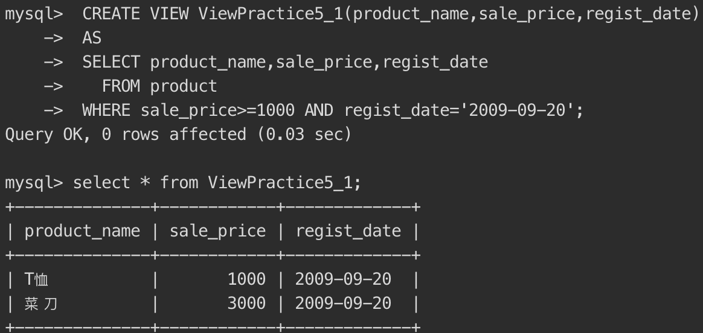

#### 3.2

向习题一中创建的视图 `ViewPractice5_1` 中插入如下数据，会得到什么样的结果？为什么？

```sql
INSERT INTO ViewPractice5_1 VALUES (' 刀子 ', 300, '2009-11-02');
```

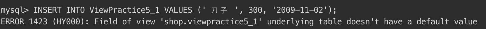

无法插入该数据，因为视图是一个虚拟表，对视图的操作是对底层基础表的操作。只有满足底层基本表的定义才能成功修改。

#### 3.3

请根据如下结果编写 SELECT 语句，其中 sale_price_all 列为全部商品的平均销售单价。

```sql
product_id | product_name | product_type | sale_price | sale_price_all
------------+-------------+--------------+------------+---------------------
0001       | T恤衫         | 衣服         | 1000       | 2097.5000000000000000
0002       | 打孔器        | 办公用品      | 500        | 2097.5000000000000000
0003       | 运动T恤       | 衣服          | 4000      | 2097.5000000000000000
0004       | 菜刀          | 厨房用具      | 3000       | 2097.5000000000000000
0005       | 高压锅        | 厨房用具      | 6800       | 2097.5000000000000000
0006       | 叉子          | 厨房用具      | 500        | 2097.5000000000000000
0007       | 擦菜板        | 厨房用具       | 880       | 2097.5000000000000000
0008       | 圆珠笔        | 办公用品       | 100       | 2097.5000000000000000
```

```sql
SELECT product_id,product_name,product_type,sale_price, 
			 (SELECT AVG(sale_price) FROM product) AS sale_price_all
	FROM product;
```

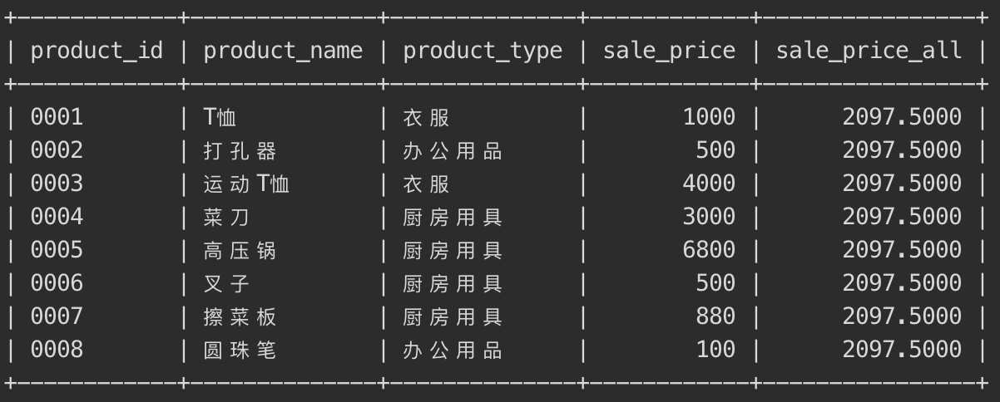

#### 3.4

请根据习题一中的条件编写一条 SQL 语句，创建一幅包含如下数据的视图（名称为AvgPriceByType）。

```sql
product_id | product_name | product_type | sale_price | avg_sale_price
------------+-------------+--------------+------------+---------------------
0001       | T恤衫         | 衣服         | 1000       |2500.0000000000000000
0002       | 打孔器         | 办公用品     | 500        | 300.0000000000000000
0003       | 运动T恤        | 衣服        | 4000        |2500.0000000000000000
0004       | 菜刀          | 厨房用具      | 3000        |2795.0000000000000000
0005       | 高压锅         | 厨房用具     | 6800        |2795.0000000000000000
0006       | 叉子          | 厨房用具      | 500         |2795.0000000000000000
0007       | 擦菜板         | 厨房用具     | 880         |2795.0000000000000000
0008       | 圆珠笔         | 办公用品     | 100         | 300.0000000000000000
```

提示：其中的关键是 `avg_sale_price` 列。与习题三不同，这里需要计算出的 是各商品种类的平均销售单价。这与使用关联子查询所得到的结果相同。 也就是说，该列可以使用关联子查询进行创建。问题就是应该在什么地方使用这个关联子查询。


```sql
CREATE VIEW AvgPriceByType
AS
SELECT p1.product_id,p1.product_name,p1.product_type,p1.sale_price, p2.avg_sale_price
FROM product AS p1,
	 (SELECT product_type,AVG(sale_price) AS avg_sale_price
    FROM product
    GROUP BY product_type) 
    AS p2
WHERE p2.product_type=p1.product_type;
```
> Wrong version
> ```sql
> CREATE VIEW AvgPriceByType
> AS
> SELECT product_id,product_name,product_type,sale_price, 
> 	(SELECT AVG(sale_price) 
> 	FROM product AS p2
> 	WHERE p2.product_name=product.product_name
> 	GROUP BY product_type) 
> 	AS avg_sale_price
> FROM product;
> ```

### 各种各样的函数

sql 自带了各种各样的函数，极大提高了 sql 语言的便利性。

所谓函数，类似一个黑盒子，你给它一个输入值，它便按照预设的程序定义给出返回值，输入值称为`参数`。

sql 自带了各种各样的函数，极大提高了 sql 语言的便利性。

* 算术函数    （用来进行数值计算的函数）
* 字符串函数 （用来进行字符串操作的函数）
* 日期函数     （用来进行日期操作的函数）
* 转换函数     （用来转换数据类型和值的函数）
* 聚合函数     （用来进行数据聚合的函数）

函数总个数超过200个，不需要完全记住，常用函数有 30~50 个，其他不常用的函数使用时查阅文档即可。

#### 算数函数

演示几个算数函数，构造`samplemath`表

```sql
-- DDL ：创建表
USE shop;
DROP TABLE IF EXISTS samplemath;
CREATE TABLE samplemath
(m float(10,3),
n INT,
p INT);

-- DML ：插入数据
START TRANSACTION; -- 开始事务
INSERT INTO samplemath(m, n, p) VALUES (500, 0, NULL);
INSERT INTO samplemath(m, n, p) VALUES (-180, 0, NULL);
INSERT INTO samplemath(m, n, p) VALUES (NULL, NULL, NULL);
-- ...
COMMIT; -- 提交事务
-- 查询表内容
SELECT * FROM samplemath;
+----------+------+------+
| m        | n    | p    |
+----------+------+------+
|  500.000 |    0 | NULL |
| -180.000 |    0 | NULL |
|     NULL | NULL | NULL |
|     NULL |    7 |    3 |
|     NULL |    5 |    2 |
|     NULL |    4 | NULL |
|    8.000 | NULL |    3 |
|    2.270 |    1 | NULL |
|    5.555 |    2 | NULL |
|     NULL |    1 | NULL |
|    8.760 | NULL | NULL |
+----------+------+------+
11 rows in set (0.00 sec)
```

* ABS -- 绝对值

语法：`ABS( 数值 )`

ABS 函数用于计算一个数字的绝对值，表示一个数到原点的距离。

当 ABS 函数的参数为`NULL`时，返回值也是`NULL`。

* MOD -- 求余数

语法：`MOD( 被除数，除数 )`

MOD 是计算除法余数（求余）的函数，是 modulo 的缩写。小数没有余数的概念，只能对整数列求余数。

注意：主流的 DBMS 都支持 MOD 函数，只有SQL Server 不支持该函数，其使用`%`符号来计算余数。

* ROUND -- 四舍五入

语法：`ROUND( 对象数值，保留小数的位数 )`

ROUND 函数用来进行四舍五入操作。

注意：当参数 **保留小数的位数** 为变量时，可能会遇到错误，请谨慎使用变量。

```sql
SELECT m,
ABS(m) AS abs_col ,
n, p,
MOD(n, p) AS mod_col,
ROUND(m,1) AS round_colS
FROM samplemath;
```

#### 字符串函数

```sql
-- DDL ：创建表
USE  shop;
DROP TABLE IF EXISTS samplestr;
CREATE TABLE samplestr
(str1 VARCHAR (40),
str2 VARCHAR (40),
str3 VARCHAR (40)
);
-- DML：插入数据
START TRANSACTION;
INSERT INTO samplestr (str1, str2, str3) VALUES ('opx',	'rt', NULL);
INSERT INTO samplestr (str1, str2, str3) VALUES ('太阳',	'月亮', '火星');
INSERT INTO samplestr (str1, str2, str3) VALUES ('@!#$%', NULL, NULL);
-- ...
COMMIT;
-- 确认表中的内容
SELECT * FROM samplestr;
+-----------+------+------+
| str1      | str2 | str3 |
+-----------+------+------+
| opx       | rt   | NULL |
| abc       | def  | NULL |
| 太阳      | 月亮 | 火星 |
| aaa       | NULL | NULL |
| NULL      | xyz  | NULL |
| @!#$%     | NULL | NULL |
| ABC       | NULL | NULL |
| aBC       | NULL | NULL |
| abc哈哈   | abc  | ABC  |
| abcdefabc | abc  | ABC  |
| micmic    | i    | I    |
+-----------+------+------+
11 rows in set (0.00 sec)
```

* CONCAT -- 拼接

语法：`CONCAT(str1, str2, str3)` 。MySQL中使用 CONCAT 函数进行拼接。

* LENGTH -- 字符串长度

语法：`LENGTH( 字符串 )`

* LOWER -- 小写转换

只针对英文字母，转换为小写。类似的， UPPER 函数用于大写转换。

* REPLACE -- 字符串的替换

语法：`REPLACE( 对象字符串，替换前的字符串，替换后的字符串 )`

* SUBSTRING -- 字符串的截取

语法：`SUBSTRING （对象字符串 FROM 截取的起始位置 FOR 截取的字符数）`

使用 SUBSTRING 函数 可以截取出字符串中的一部分字符串。截取的起始位置从字符串最左侧开始计算，索引值起始为1。

```sql
SELECT str1,str2,str3,
	CONCAT(str1,str2,str3) AS str_concat,
	LENGTH(str1) AS len_str,
	LOWER(str1) AS low_str,
	REPLACE(str1,str2,str3) AS rep_str,
	SUBSTRING(str1 FROM 3 FOR 2) AS sub_str
FROM samplestr;
```

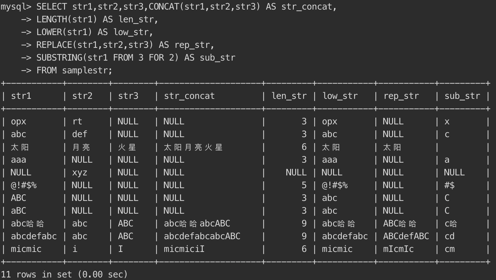

#### 日期函数

不同DBMS的日期函数语法各有不同，本课程介绍一些被标准 SQL 承认的可以应用于绝大多数 DBMS 的函数。特定DBMS的日期函数查阅文档即可

* CURRENT_DATE -- 获取当前日期

```sql
SELECT CURRENT_DATE;
+--------------+
| CURRENT_DATE |
+--------------+
| 2021-09-19  |
+--------------+
```

* CURRENT_TIME -- 当前时间

```sql
SELECT CURRENT_TIME;
+--------------+
| CURRENT_TIME |
+--------------+
|  10:02:52     |
+--------------+
```

* CURRENT_TIMESTAMP -- 当前日期和时间

```sql
 SELECT CURRENT_TIMESTAMP;
+---------------------+
| CURRENT_TIMESTAMP   |
+---------------------+
| 2021-09-19 10:03:19 |
+---------------------+
```

* EXTRACT -- 截取日期元素

语法：`EXTRACT(日期元素 FROM 日期)`

使用 EXTRACT 函数可以截取出日期数据中的一部分，例如“年”

“月”，或者“小时”“秒”等。该函数的返回值并不是日期类型而是数值类型

```sql
SELECT CURRENT_TIMESTAMP as now,
EXTRACT(YEAR   FROM CURRENT_TIMESTAMP) AS year,
EXTRACT(MONTH  FROM CURRENT_TIMESTAMP) AS month,
EXTRACT(DAY    FROM CURRENT_TIMESTAMP) AS day,
EXTRACT(HOUR   FROM CURRENT_TIMESTAMP) AS hour,
EXTRACT(MINUTE FROM CURRENT_TIMESTAMP) AS MINute,
EXTRACT(SECOND FROM CURRENT_TIMESTAMP) AS second;
+---------------------+------+-------+------+------+--------+--------+
| now                 | year | month | day  | hour | MINute | second |
+---------------------+------+-------+------+------+--------+--------+
| 2021-09-19 10:05:17 | 2021 |     9 |   19 |   10 |      5 |     17 |
+---------------------+------+-------+------+------+--------+--------+
```

#### 转换函数

在 SQL 中主要有两层意思：

1. 是数据类型的转换，简称为类型转换，在英语中称为`cast`；
2. 另一层意思是值的转换。

* CAST -- 类型转换

语法：`CAST（转换前的值 AS 想要转换的数据类型）

```sql
-- 将字符串类型转换为数值类型
SELECT CAST('0001' AS SIGNED INTEGER) AS int_col;
+---------+
| int_col |
+---------+
|       1 |
+---------+

-- 将字符串类型转换为日期类型
SELECT CAST('2021-09-19' AS DATE) AS date_col;
+------------+
| date_col   |
+------------+
| 2021-09-19 |
+------------+
```

* COALESCE -- 将NULL转换为其他值

语法：`COALESCE(数据1，数据2，数据3……)`

COALESCE 是 SQL 特有的函数。该函数会返回可变参数 A 中左侧开始第 1个不是NULL的值。参数个数是可变的，因此可以根据需要无限增加。

在 SQL 语句中将 NULL 转换为其他值时就会用到转换函数。

```sql
SELECT COALESCE(NULL, 11) AS col_1,
COALESCE(NULL, 'hello world', NULL) AS col_2,
COALESCE(NULL, NULL, '2021-09-19') AS col_3;
+-------+-------------+------------+
| col_1 | col_2       | col_3      |
+-------+-------------+------------+
|    11 | hello world | 2021-09-19 |
+-------+-------------+------------+
```

### 谓词

#### 什么是谓词

谓词就是返回值为真值的函数。包括`TRUE / FALSE / UNKNOWN`。

谓词主要有以下几个：

* LIKE
* BETWEEN
* IS NULL、IS NOT NULL
* IN
* EXISTS

#### LIKE谓词 -- 用于字符串的部分一致查询

...

### 练习题-第二部分

####  3.5判断题

运算中含有 NULL 时，运算结果是否必然会变为NULL ？

否，SUM等函数含有NULL时不会全为NULL

#### 3.6

对本章中使用的 `product`（商品）表执行如下 2 条 `SELECT` 语句，能够得到什么样的结果呢？

①

```sql
SELECT product_name, purchase_price
  FROM product
 WHERE purchase_price NOT IN (500, 2800, 5000);
```

②

```sql
SELECT product_name, purchase_price
  FROM product
 WHERE purchase_price NOT IN (500, 2800, 5000, NULL);
```

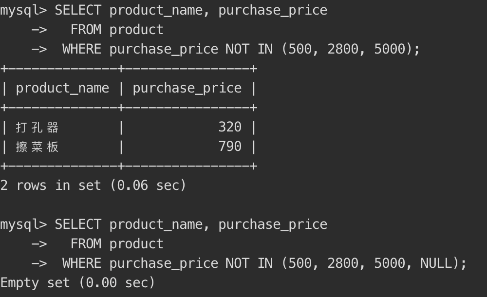

第一条返回购买价格不是500，2000，5000的对应行的产品名称和购买价格

第二条因为NOT IN的参数含有NULL，所以结果为空。

#### 3.7

按照销售单价( `sale_price` )对练习 3.6 中的 `product`（商品）表中的商品进行如下分类。

* 低档商品：销售单价在1000日元以下（T恤衫、办公用品、叉子、擦菜板、 圆珠笔）
* 中档商品：销售单价在1001日元以上3000日元以下（菜刀）
* 高档商品：销售单价在3001日元以上（运动T恤、高压锅）

请编写出统计上述商品种类中所包含的商品数量的 SELECT 语句，结果如下所示。

执行结果

```sql
low_price | mid_price | high_price
----------+-----------+------------
        5 |         1 |         2
```

```sql
SELECT 
	COUNT(CASE WHEN sale_price <= 1000 THEN sale_price END) AS low_price,
  COUNT(CASE WHEN sale_price BETWEEN 1001 AND 3000 THEN sale_price end) AS mid_price,
  COUNT(CASE WHEN sale_price >= 3001 THEN sale_price END) AS high_price
FROM product;
```

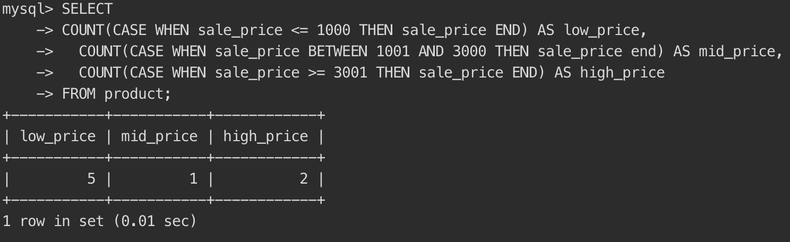

