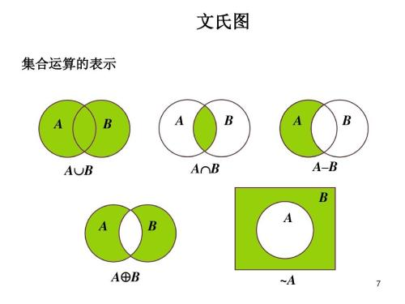
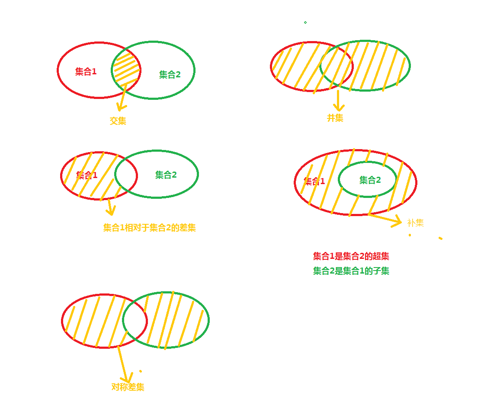
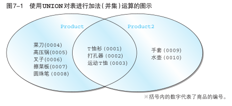

## 04_set_operation

### 表的加减法

#### 什么是集合运算

`集合`在数学领域表示“各种各样的事物的总和”, 在数据库领域表示记录的集合. 具体来说,表、视图和查询的执行结果都是记录的集合, 其中的元素为表或者查询结果中的每一行。

在标准 SQL 中, 分别对检索结果使用 `UNION`, `INTERSECT,` `EXCEPT` 来将检索结果进行并,交和差运算, 像`UNION`,`INTERSECT`, `EXCEPT`这种用来进行集合运算的运算符称为集合运算符。

以下的文氏图展示了几种集合的基本运算。





所有的表--以及查询结果--都可以视为集合, 可把表视为集合进行上述集合运算, 在很多时候, 这种抽象非常有助于对复杂查询问题给出一个可行的思路。

#### 表的加法--UNION

##### UNION

```sql
SELECT product_id, product_name
  FROM Product
 UNION
SELECT product_id, product_name
  FROM Product2;
```




 **UNION 等集合运算符通常都会除去重复的记录**。

**练习题:**

假设连锁店想要增加毛利率超过 50%或者售价低于 800 的货物的存货量, 请使用 UNION 对分别满足上述两个条件的商品的查询结果求并集。

```sql
SELECT product_id, product_name, product_type, sale_price, purchase_price
  FROM product
 WHERE (sale_price-purchase_price)/purchase_price>0.5
 
 UNION
 
SELECT product_id, product_name, product_type, sale_price, purchase_price
  FROM product
 WHERE sale_price<800;
```


##### UNION 与 OR 谓词

UNION 对两个查询结果取并集, 和在一个查询中使用 WHERE 子句, 然后使用 OR 谓词连接两个查询条件, 能够得到相同的结果。

但倘若要将两个不同的表中的结果合并在一起, 就不得不使用 UNION 了.。

**练习题 :** 

分别使用 UNION 或者 OR 谓词,找出毛利率不足 30%或毛利率未知的商品。

```sql
SELECT product_id,product_name,sale_price,purchase_price
	FROM product
 WHERE (sale_price-purchase_price)/purchase_price<0.3 
 		OR sale_price/purchase_price IS NULL;

-- 2
SELECT product_id,product_name,sale_price,purchase_price
	FROM product
 WHERE (sale_price-purchase_price)/purchase_price<0.3 
 UNION 
SELECT product_id,product_name,sale_price,purchase_price
	FROM product
 WHERE sale_price/purchase_price IS NULL;
```


##### 包含重复行的集合运算 UNION ALL

如果需要不去重的并集, 只需要在 UNION 后面添加 ALL 关键字就可以了。

```sql
-- 保留重复行
SELECT product_id, product_name
  FROM Product
 UNION ALL
SELECT product_id, product_name
  FROM Product2;
```

**练习题:** 

商店决定对product表中利润高于50% **或者** 售价低于1000的商品提价, 请使用UNION ALL 语句将分别满足上述两个条件的结果取并集. 查询结果类似下表: 

```sql
SELECT product_id, product_name, product_type, sale_price, purchase_price
  FROM product
 WHERE (sale_price-purchase_price)/purchase_price>0.5
 
 UNION ALL
 
SELECT product_id, product_name, product_type, sale_price, purchase_price
  FROM product
 WHERE sale_price<1000;
```


##### 隐式数据类型转换

如果两个数据类型不完全相同, 可通过隐式类型转换来将两个类型不同的列放在一列里显示, 例如字符串和数值类型: 

```sql
SELECT product_id, product_name, '1'
  FROM Product
 UNION
SELECT product_id, product_name,sale_price
  FROM Product2;
```


**需要注意的是 hive中进行join关联时，关联列要避免使用隐式数据类型转换，否则容易导致数据倾斜**

##### MySQL 8.0 不支持交运算INTERSECT

```sql
SELECT product_id, product_name
  FROM Product
  
INTERSECT
SELECT product_id, product_name
  FROM Product2;
```

> ERROR 1064 (42000): You have an error in your SQL syntax; check the manual that corresponds to your MySQL server version for the right syntax to use near 'SELECT product_id, product_name
>   FROM Product2' at line 5

此时需要用 inner join 来求得交集

```sql
SELECT p1.product_id, p1.product_name
  FROM Product p1
INNER JOIN Product2 p2
ON p1.product_id=p2.product_id;
```

#### 差集,补集与表的减法

求集合差集的减法运算和实数的减法运算有些不同, 当使用一个集合A减去另一个集合B的时候,对于只存在于集合B而不存在于集合A的元素, 采取直接忽略的策略,因此集合A和B做减法只是将集合A中也同时属于集合B的元素减掉。

##### MySQL 8.0 还不支持 EXCEPT 运算

不过, 借助NOT IN 谓词, 同样可以实现表的减法。

找出只存在于Product表但不存在于Product2表的商品。

```sql
-- 使用 NOT IN 子句的实现方法
SELECT * 
  FROM Product
 WHERE product_id NOT IN (SELECT product_id 
                            FROM Product2);
```


##### EXCEPT 与 NOT 谓词

 使用 NOT IN 谓词, 基本上可以实现和SQL标准语法中的EXCEPT运算相同的效果。

```sql
SELECT *
FROM product
WHERE sale_price>2000
AND product_id NOT IN (SELECT product_id FROM product WHERE sale_price/purchase_price<1.3);
```


##### INTERSECT 与 AND 谓词

对于同一个表的两个查询结果而言, 他们的交INTERSECT实际上可以等价地将两个查询的检索条件用AND谓词连接来实现。

#### 对称差 

两个集合A,B的对称差是指那些仅属于A或仅属于B的元素构成的集合. 对称差也是个非常基础的运算, 例如, 两个集合的交就可以看作是两个集合的并去掉两个集合的对称差.

上述方法在其他数据库里也可以用来简单地实现表或查询结果的对称差运算: 首先使用UNION求两个表的并集, 然后使用INTERSECT求两个表的交集, 然后用并集减去交集, 就得到了对称差。


...


# 练习题

# **4.1** 

找出 product 和 product2 中售价高于 500 的商品的基本信息。

# **4.2**

借助对称差的实现方式, 求product和product2的交集。

# **4.3**

每类商品中售价最高的商品都在哪些商店有售 ？

# **4.4**

分别使用内连结和关联子查询每一类商品中售价最高的商品。

# **4.5** 

用关联子查询实现：在 product 表中，取出 product_id, produc_name, slae_price, 并按照商品的售价从低到高进行排序、对售价进行累计求和。

